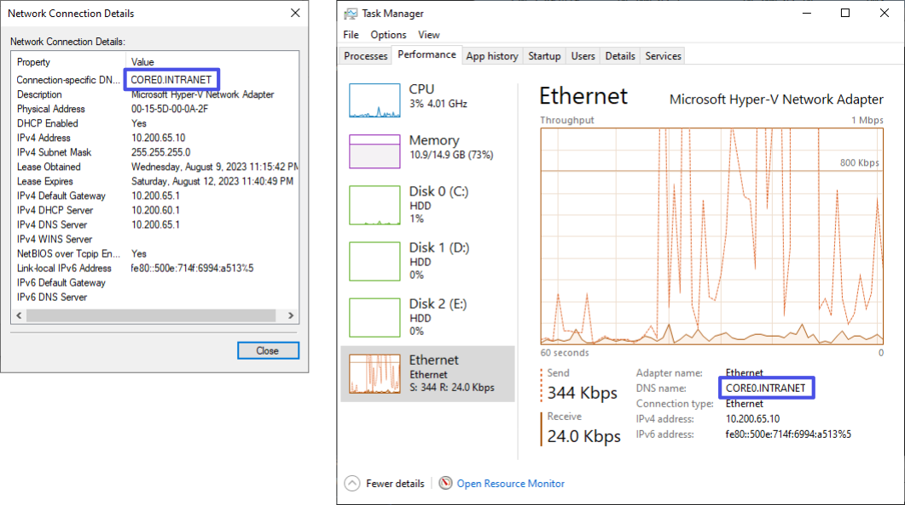
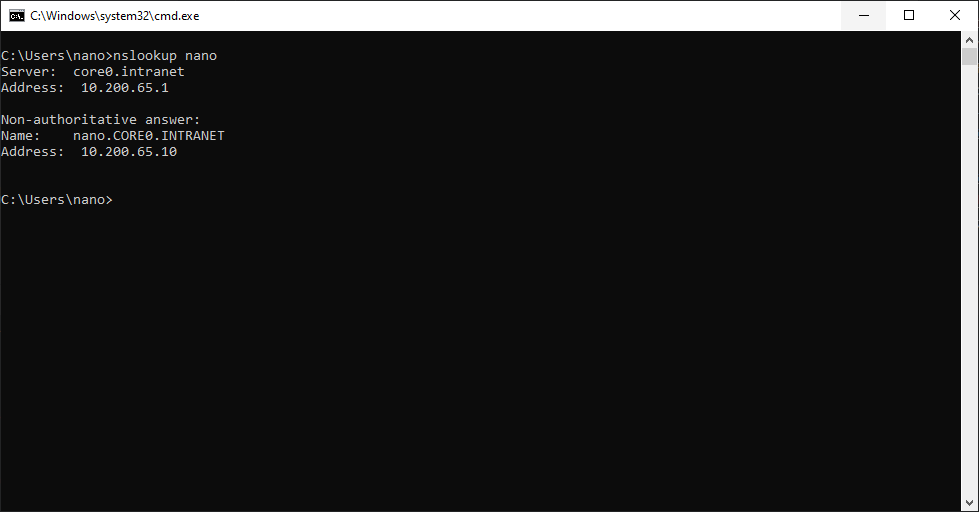
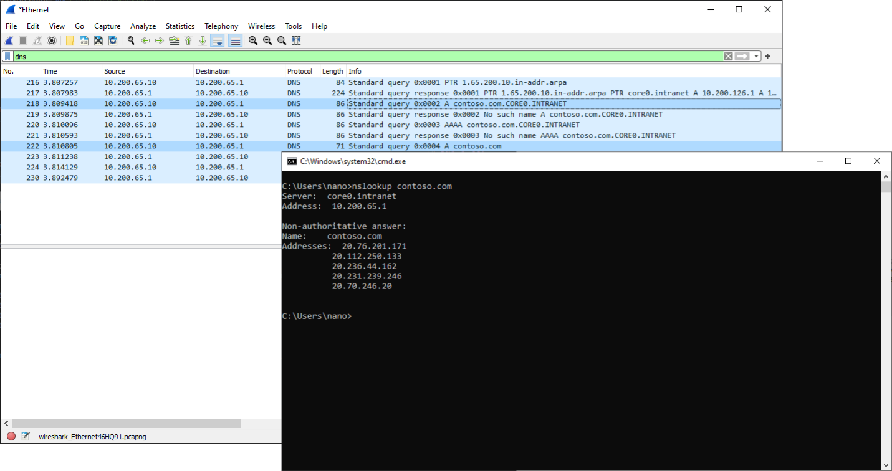

## 프롤로그

  
운영체제마다 표현법이나 위치가 다르나 컴퓨터 네트워크 설정에는 DNS Suffix 항목이 존재하는 경우가 있습니다. 본문에서는 DNS Suffix의 기능 등에 대해 설명할 것입니다.

## DNS Suffix

    
DNS Suffix는 DNS 질의 시 도메인 이름의 뒤에 붙은 기본 주소입니다. contoso.com라는 회사 내부에서 네트워크 관리자가 DNS Suffix 속성을 제공하면, `file.contoso.com`의 IP
주소를 알고자 할 때 `files`를 입력하면 주소 뒤에 `.contoso.com`을 붙여서 DNS로 질의됩니다.

### 어떤 때 DNS Suffix가 사용되는가?

"contoso.com과 같이 실존하는 도메인 이름을 질의할 때 운영체제는 어떻게 DNS Suffix를 붙일지 말지 결정할까?" 라는 의문이 생겼습니다. DNS Suffix가 설정되어 있는 경우 운영체제가 어떻게
동작하는지 찾아보고자 RFC 1034(Domain Names - Concepts and Facilities), RFC 1035(Domain Names - Implementation and Specification)
등을 살펴보았으나 표준이 있는 것처럼 보이진 않는 것으로 보였습니다. 실존할 것으로 보이는 DNS를 질의하는 동안 WireShark 패킷 캡처를 통하여 운영체제가 어떤 도메인 이름을 질의하는지 확인하는 것으로
검증해보는 시간을 가져봤습니다.

검증 결과로, Windows 10 운영체제는 DNS Suffix의 사용 여부를 판단하지 않으며 DNS Suffix가 네트워크 제공자로부터 설정된 경우 (1)DNS Suffix를 붙여서 한 번, (2)DNS
Suffix를 붙이지 않고 한 번, 총 두 차례 질의하는 것을 확인하였습니다.

추가로 확인한 결과, (1)DNS Suffix를 붙인 질의 결과가 존재하는 경우 (2)DNS Suffix를 붙이지 않은 질의는 하지 않는 것으로 보입니다.

운영체제가 DNS Suffix를 취급하는 동작에 관한 표준이 명세되어 있지 않는 것으로 추정되는 바, 위에서 검증한 내용은 Windows 10 외 다른 운영체제에서 다르게 동작할 수 있다는 사실을 밝혀둡니다.

## 레퍼런스

- [DNS Standards Documents](https://learn.microsoft.com/en-us/windows/win32/dns/dns-standards-documents)
