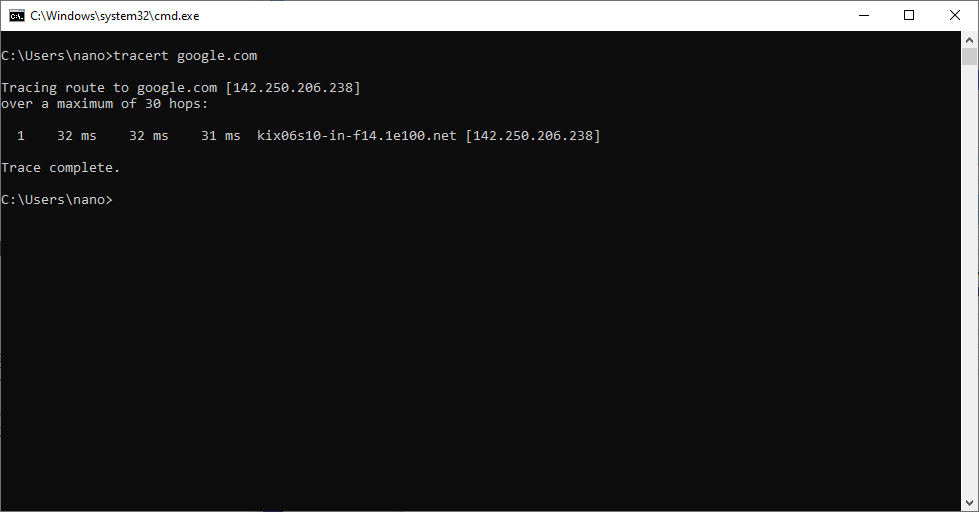

## 프롤로그

Traceroute를 사용하면 목적지 IP 주소까지 도달하기 위해 통과하는 라우터 홉을 추적할 수 있습니다. 본문에서는 ICMP 메시지를 가로채서 Traceroute를 방지하는 방법에 대해 알아봅니다.

## Time To Live

패킷이 목적지에 도달하지 못하고 일정한 구간을 계속 순환하는 ‘Loop’ 현상 등을 방지하기 위해 IP(Internet Protocol)에는 TTL(Time To Live) 필드가 존재합니다. TTL은 운영체제마다
다르나 통상적으로 64나 128로 시작하며 Layer 3 장치를 통과할 때마다 1 만큼 감소합니다. 라우터가 TTL 값이 0인 패킷을 수신하는 경우, 출발지에게 ICMP Type 11(Time Exceeded)
메시지를 반송합니다.

## Traceroute


앞서 설명한 것과 같이 라우터가 TTL 값이 0인 패킷을 받으면 ICMP Type 11 메시지를 반환한다는 사실을 이용합니다. TTL 값을 의도적으로 1부터 시작하여 목적지 IP 주소에 도달할 때까지 증가시켜가며
ICMP Type 11 메시지를 수집하면 라우터 홉을 추적할 수 있습니다.

## Traceroute 통제

Traceroute는 TTL 값을 증가시켜가며 목적지 IP 주소에 도달하면 추적을 종료합니다. 이 특성을 이용하여 라우터 등 네트워크 장비에서 나가는 ICMP Type 8(Echo Request) 패킷을 임의로
제어하면 Traceroute 결과를 통제할 수 있습니다.

### TTL 값 임의 수정

TTL 값이 30 이하인 나가는 ICMP Type 8 패킷의 TTL 값을 128 등으로 상승시키면 대체로 목적지까지 즉시 전달됩니다.



### 비정상 TTL 값 차단

TTL 값이 30 이하인 나가는 ICMP Type 8 패킷을 차단하면 Traceroute를 완전히 차단할 수 있습니다.


### 외부 라우터 홉에 대한 Traceroute 방지

TTL 값이 2 이상인 나가는 ICMP Type 8 패킷의 TTL 값을 128 등으로 상승시키면 내부 라우터 홉에 대한 Traceroute만 허용할 수 있습니다. 기준 TTL은 내부 네트워크 구성에 따라 다르게
설정해야 합니다.


### 내부 라우터 홉에 대한 Traceroute 방지

반대로 TTL 값이 2 이하인 나가는 ICMP Type 8 패킷을 차단하면 외부 라우터 홉에 대한 Traceroute만 허용할 수 있습니다. 기준 TTL은 내부 네트워크 구성에 따라 다르게 설정해야 합니다.


## 회피, 그리고 추가적인 방지 대책

기본 Traceroute는 ICMP Type 8 메시지로의 추적만을 제공합니다. TTL은 ICMP 외 다른 프로토콜에서도 지원합니다. TCP나 UDP 등 일상적으로 사용되는 것을 사용하는 별도의 프로그램을 제작하면
회피할 수 있습니다.

이러한 경우에 대한 방지 대책으로, TTL 값 제어를 ICMP Type 8을 포함한 모든 패킷으로 확대할 수 있습니다. TTL 값 제어 대신 패킷을 차단하는 경우 mDNS 등 운영체제 기능 일부가 오동작할 수 있다는
사실에 주의해야 합니다.

## MikroTik RouterOS에서 설정하기

다음은 Blackhole routing을 위한 라우팅 테이블 및 엔트리를 생성하고, TTL 값이 30 이하인 나가는 패킷의 TTL 값을 255로 설정하는 방화벽 정책을 생성하기 위한 명령어입니다.

```plaintext
/ip vrf add interfaces=none name=null
/ip route add blackhole dst-address=0.0.0.0/0 routing-table=null

/ip firewall mangle \
	add action=change-ttl chain=postrouting comment="[*] Prevent traceroute" \
	src-address=10.200.0.0/16 dst-address=!10.200.0.0/16 \
	ttl=less-than:31 \
	new-ttl=set:255 passthrough=yes
```
