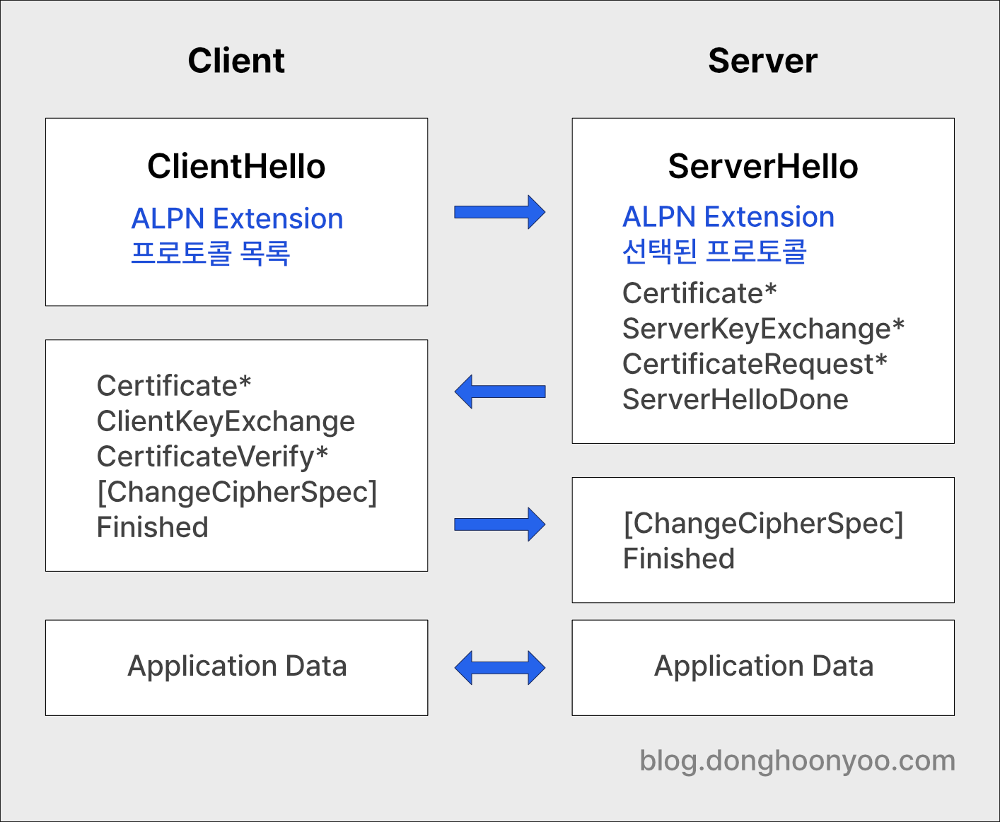

## 소개

애플리케이션 레이어 프로토콜(예: HTTP)은 TLS에 캡슐화될 수 있습니다. 만약 하나의 서버의 443포트에서 여러 애플리케이션이 실행 중이라고 하면, 클라이언트와 서버는 애플리케이션 레이어의 프로토콜 정보를
협상할 필요가 있습니다.

ALPN은 추가적인 협상 과정(round-trip) 없이 TLS 핸드셰이크 과정에서 애플리케이션 레이어의 프로토콜에 관하여 협상하는 기능을 제공하는 TLS Extension입니다.

## 동작 방식

TLS는 메시지에 TLS Extension 필드를 제공하며, ALPN은 TLS Extension입니다. ALPN을 사용하려는 경우 클라이언트가 TLS ClientHello 메시지를 발송할 때 지원하는 애플리케이션
프로토콜 리스트를 포함합니다. 서버는 리스트에서 하나의 프로토콜을 선택하여 TLS ServerHello 메시지 발송 시에 포함합니다.



## 프로토콜 협상

IANA — Transport Layer Security (TLS) Extensions에 따르면 application_layer_protocol_negotiation(16, RFC 7301)이 명시되어
있습니다. `application_layer_protocol_negotiation`은 `ProtocolNameList`을 포함해야 합니다. 클라이언트는 지원하는 프로토콜이 여러 개인 경우 ClientHello
메시지에 프로토콜 리스트를 선호하는 순서대로 포함해야 합니다. 이때 서버는 가능한한 가장 선호되는 프로토콜을 선택해야만 합니다. 서버는 일단 연결이 성립되면, 연결이 다시 종료될 때까지 선택했던 프로토콜을 확정적으로
지원해야 합니다. 다시 연결이 성립되지 않는 한 한 번 선택된 프로토콜은 변경할 수 없습니다.

```plaintext
enum {
	application_layer_protocol_negotiation(16), (65535)
} ExtensionType;

opaque ProtocolName<1..2^8-1>;

struct {
	ProtocolName protocol_name_list<2..2^16-1>
} ProtocolNameList;
```

### 지원하는 프로토콜이 없는 경우

만약 서버는 클라이언트가 제시한 프로토콜 중 지원 가능한 프로토콜이 없는 경우 `no_application_protocol` 알림을 보내야 합니다.

```plaintext
enum {
	no_application_protocol(120), (255)
} AlertDescription;
```

## ALPN 프로토콜

주요 ALPN 프로토콜은 다음과 같습니다. 그 외 프로토콜 목록은 하단의 레퍼런스 섹션의 ‘TLS Application-Layer Protocol Negotiation (ALPN) Protocol IDs’를
참고하시기 바랍니다.

- HTTP/0.9: `http/0.9`
- HTTP/1.0: `http/1.0`
- HTTP/1.1: `http/1.1`
- HTTP/2 over TLS: `h2`
- HTTP/2 over TCP: `h2c`
- HTTP/3: `h3`

## 보안

ALPN을 통한 애플리케이션 프로토콜의 결정은 암호화되지 않은 TLS 연결 성립 단계에서 처리되므로 plaintext로 정보가 교환됩니다. 드물게 프로토콜 정보를 숨기고자 하는 경우에는 연결이 성립된 이후 재협상해야
하는 것이 좋습니다.

## 레퍼런스

- [RFC 7301 — TLS; Application-Layer Protocol Negotiation Extension](https://www.rfc-editor.org/rfc/rfc7301.html)
- [IANA — Transport Layer Security (TLS) Extensions](https://www.iana.org/assignments/tls-extensiontype-values/tls-extensiontype-values.xhtml)
- [IANA — TLS Application-Layer Protocol Negotiation (ALPN) Protocol IDs](https://www.iana.org/assignments/tls-extensiontype-values/tls-extensiontype-values.xhtml#alpn-protocol-ids)
