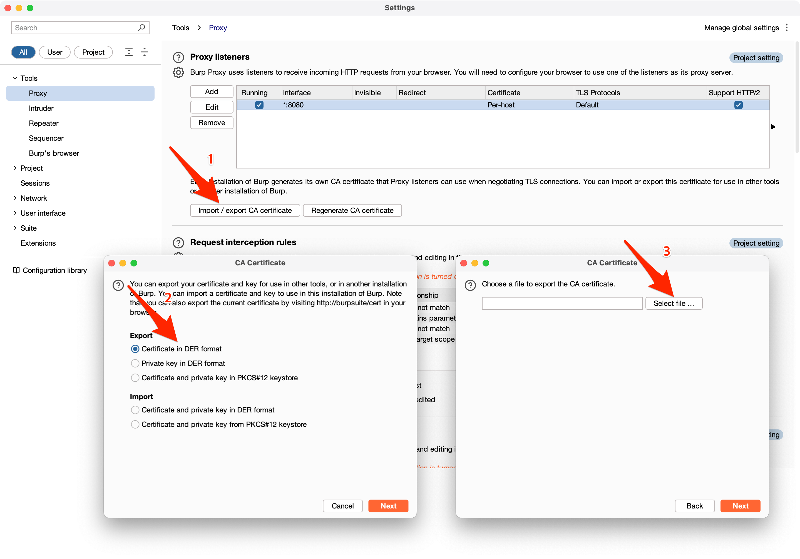

## 면책
본문은 학습 및 적법한 절차에 따라 응용 프로그램 개발자로부터 허용 받은 범위에 한정된 분석을 지원하기 위하여 작성된 것입니다. 
독자께서는 응용 프로그램의 통신 활동을 분석하기 전에 권리자로부터의 사전 서면 허가를 득하십시오. 
본문의 독자는 제 3자의 응용 프로그램의 어떠한 권리도 침해해서는 아니되며 그로 인한 민•형사상의 책임은 독자에게 있습니다.

## 프롤로그
대부분의 웹 브라우저는 개발자 도구라는 이름으로 웹 통신 기록 확인 기능을 제공하며 개발자 및 보안 전문가에게 많은 사랑을 받아오고 있습니다. 
Burp Suite Proxy의 Intercept 및 HTTP 또한 웹(HTTP) 통신의 분석에 탁월한 기능을 제공하는데요. 
본문에서는 이 기능을 iOS 또는 iPadOS 응용 프로그램의 웹 통신 활동 분석에 적용하는 방법을 공유하고자 합니다. 
본문의 내용은 SSL 통신에 대한 감사를 포함하므로 훨씬 더 광범위한 분석 활동을 허용합니다.

## 요구 사항
* Apple iOS 또는 iPadOS(이하 '분석 대상 기기'): [Apple 기기 감독(Device Supervision)](https://support.apple.com/ko-kr/guide/deployment/dep1d89f0bff/web) 대상으로 기기
* Apple Mac
    * [Apple Configurator](https://apps.apple.com/kr/app/apple-configurator/id1037126344?l=en-GB&mt=12): Mac App Store에서 무료
* [Burp Suite](https://portswigger.net/burp): Community 또는 상위 호환의 제품이 실행 중인 컴퓨터 또는 서버(이하 '수집 기기')
* 상기 기기 간의 네트워크 직접 연결성
  
본문에서 설명하는 내용을 적용하기 위한 요구 사항으로 분석 대상 기기 및 Apple Mac 기기가 필요합니다. 분석 대상 기기에 Apple 기기 감독이 활성화되어 있어야 합니다. 
분석 대상 기기와 수집 기기 사이의 네트워크 직접 연결성이 요구됩니다. 구체적으로 말씀드리자면, 분석 대상 기기는 수집 기기에서 실행되는 HTTP proxy 서버에 연결 가능해야 합니다. 
분석 대상 기기의 웹 통신 활동이 수집 기기를 경유하는 것을 지시하기 위해서 Apple Mac의 Apple Configurator을 통한 profile 생성이 필요합니다.

## 한계 및 방지 방법
본문에서 설명하는 분석 방법은 HTTP Proxy를 기반으로 합니다. 따라서 SSL/TLS 암호화 연결의 통신 분석을 위하여 SSL Inspection 방식을 사용합니다. 
응용 프로그램 개발자는 통신 분석을 방지하기 위하여 애플리케이션에 [SSL Pinning](https://owasp.org/www-community/controls/Certificate_and_Public_Key_Pinning) 기술을 적용할 수 있습니다. 

## 모니터링 구성
### 1. Burp Suite Proxy 구성
1. 'Burp Suite Proxy' 탭을 클릭하세요.
2. 'Proxy settings' 버튼을 클릭하세요.
3. 기본 생성된 localhost 전용 proxy 서버 항목을 클릭하세요.
4. 'Edit' 버튼을 클릭하세요.
5. 'All interfaces' 항목을 클릭하세요.

### 2. Burp Suite SSL Inspection 인증서 추출
1. 'Import / export CA certificate' 버튼을 클릭하세요.
2. 'Export / Certificate in DER format' 버튼을 클릭하세요.
3. 'Select file' 버튼을 클릭하세요. 그런 다음 원하는 파일 이름과 `.der` 확장명로 저장하세요.

### 3. Profile 생성 및 적용
1. 'New Profile' 버튼을 클릭하세요.
2. 희망하는 Profile 이름을 입력하세요.
3. Global HTTP Proxy 항목에서 Proxy Server and Port 항목의 값을 입력하세요.(분석 대상 기기와 연결하려는 서브넷의 IP 주소)
4. Certificates 항목에서 방금 전 추출한 인증서를 불러오세요.
5. Profile을 저장한 다음, 기기의 profile 목록에 끌어서 넣으세요.

### 4. 모니터링
다음의 이미지와 같이 분석 대상 기기의 웹 통신 내용을 분석할 수 있습니다.

