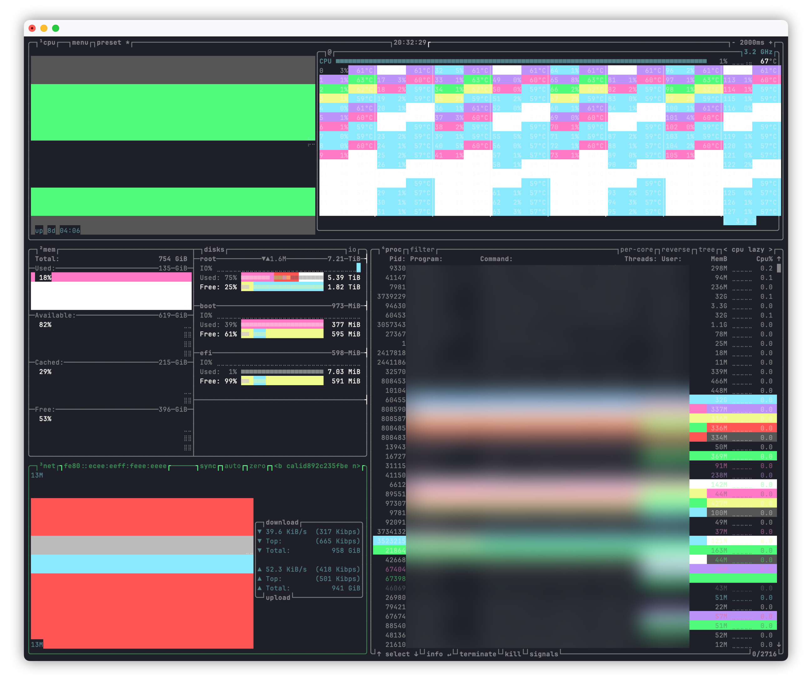
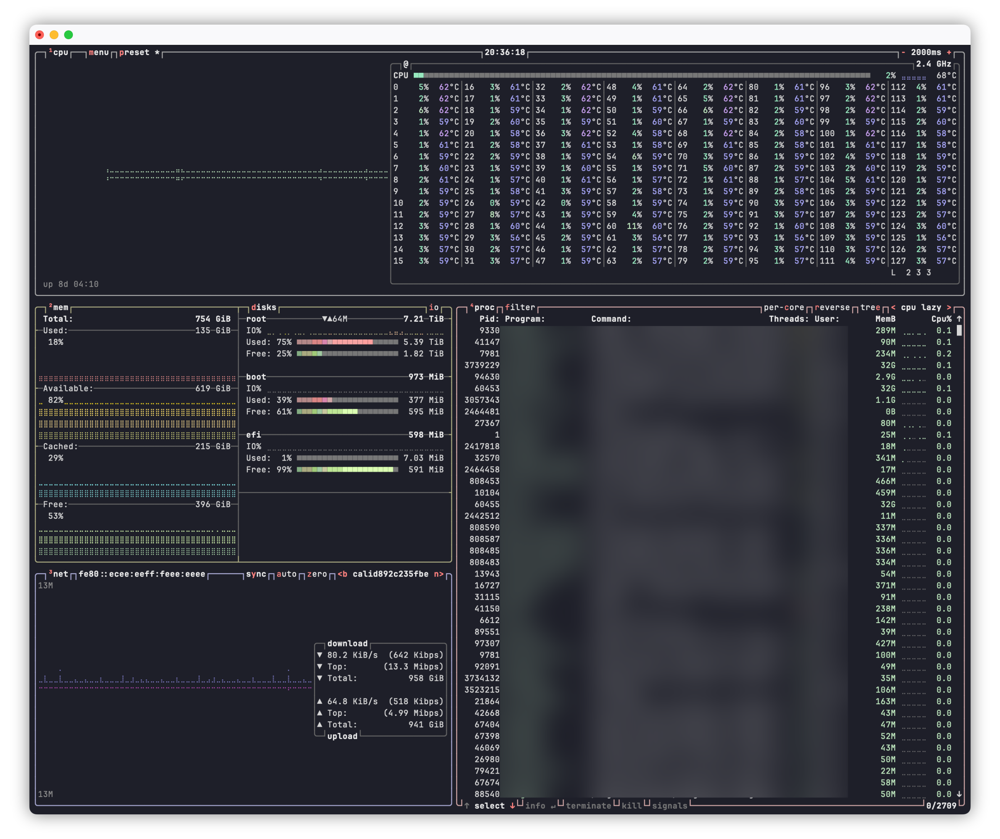

## 프롤로그
최근에는 간단히 시스템 상태를 확인하는데 `htop`, `ps` 대신 `btop`을 주로 사용하고 있습니다. btop에는 그래프도 표시되는 등 비교적 화려한 편인데, 커스텀된 터미널 색 프로파일을 사용하면 그래프가 알록달록하게 깨지는 현상이 있습니다.



## 해결 방법
btop의 `theme_background`와 `truecolor` 기능을 비활성화하면 됩니다. 커스텀된 터미널 색 프로파일과 어떤 관계가 있는지, macOS 기본 터미널이 외 다른 터미널에서는 어떻게 동작하는지는 확인하지 못했습니다. 따라서, 이것이 이유라고는 단언할 수 없습니다.  

btop 속성은 `~/.config/btop/btop.conf`에 있으며, 아래는 `theme_background`와 `truecolor` 기능을 비활성화하면 명령줄입니다.
```shell
sed -i 's/^#\?theme_background = True/theme_background = False/' ~/.config/btop/btop.conf
sed -i 's/^#\?truecolor = True/truecolor = False/' ~/.config/btop/btop.conf
```

변경을 마치면 아래와 같이 정상적으로 표시되는 것을 확인할 수 있습니다.
