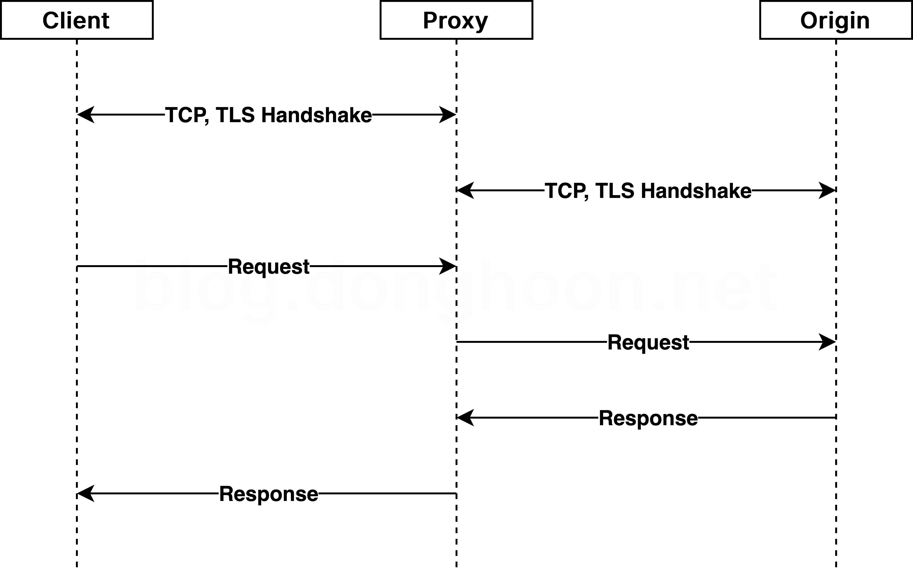
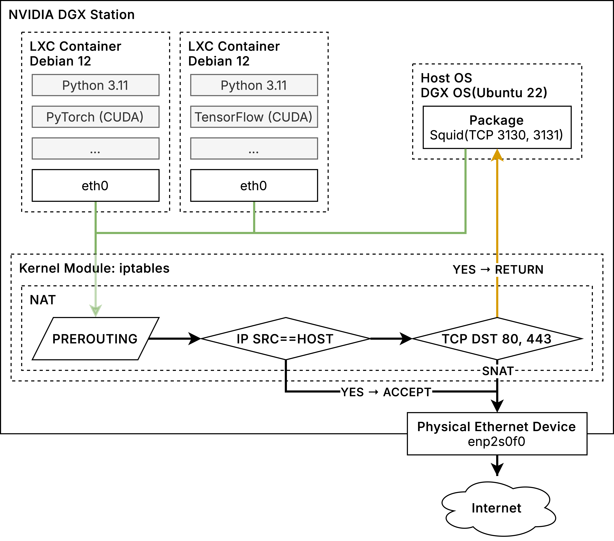

## 프롤로그
인터넷 속도가 느린 네트워크 환경을 위해서 Squid 기반 HTTPS 프록시 서버를 구성한 내용을 정리했습니다. 

## Squid
**Squid는 웹을 위한 프록시 소프트웨어입니다.** HTTP, HTTPS, FTP 등의 많은 프로토콜을 지원합니다. 대역폭 부담과 응답 시간을 줄여준다고 소개되어 있습니다. 
오래된 소프트웨어인데 소스트리 커밋 현황을 살펴보면 최소한의 관리는 이뤄지고 있습니다. VyOS를 포함한 오픈소스 라우터 OS에도 많이 내장되어 있네요. 
기능 자체는 정방향, 역방향 프록시를 모두 지원한다고 되어있으나, 사례를 찾아본 결과와 HAProxy의 존재를 고려해보면 역방향 프록시를 위해 Squid가 선택되는 일은 드물고 주로 정방향 프록시로만 사용되는 것으로 생각됩니다.  
  
요구사항과 완전히 일치하는 다른 소프트웨어는 없었습니다. Squid에서 컨테이너 이미지를 제공하지 않는 등 구축 과정이 번거로웠던 탓에 구축하는 동안 다른 소프트웨어를 알아보았으나 결과적으로는 Squid로 구성을 마무리했습니다.

## 요구사항
대학교에서 운용 중인 GPU 하드웨어를 포함 Linux 시스템에서 Python으로 딥러닝 모델 개발을 하는 환경입니다. 
학교마다 차이가 있겠으나 저희 학교는 IP 주소 당 일정한 대역폭 제한을 두고 있으며 요청하더라도 100Mbps 이상을 기대하기 어려웠던 경험이 있었습니다. 
사전 학습된 모델이나 데이터셋 반출입이 가장 곤란한 문제이나, 의외로 이 문제는 스토리지를 직접 옮기거나 40Gbps 이상을 지원하는 로컬 링크 접근 외 대안이 없어 포기했습니다. 
사실 모델 파일은 사람이 구현한 코드로 취급하기도 했고, 데이터가 크게 변화하지 않는 관계로 Rclone으로 변경 부분만 동기화할 수 있어서 큰 문제가 아니었습니다. 
**Debian과 Python 패키지을 다운로드하는데 소요되는 시간을 최적화하는 것이 목표였습니다.** 
PyTorch를 기준으로 NVIDIA CUDA 지원이 포함된 패키지들은 의존성 용량을 다 합하였을 때 7 GB에 달할 정도로 상당한 편이기도 합니다.

## SSL Interception


콘텐츠를 취급해야 하는 프록시 서버는 암호화된 내용을 확인할 수 있어야 합니다. 위 과정에서 Client와 Origin 사이의 연결을 단순히 중계하면 암호화된 내용을 확인할 수 없습니다. 이를 위해서 SSL Interception(Deep Packet Inspection)을 사용하는데, Client - Proxy, Proxy - Origin 간 독립된 세그먼트를 생성합니다. Proxy는 Client에 대하여 독립된 서버인 것처럼 자신 고유의 서버 측 인증서를 제공하며, 요청과 응답에 대해서만 Client의 요청에 Origin의 응답이 그대로 전달되도록 보장합니다.

## 주의사항
* <u>**기술과 정책 전반을 아우르는 보안 전문가가 아니거나 잘 모르겠다면, 절대 따라하지 마십시오.**</u> 이 글에서는 그러한 목적으로 다루고 있지 않으나, **SSL Interception는 사용자 계정, 암호 등 보호되어야 하는 내용을 도청하는데도 악용되는 기술입니다. 그러한 목적으로 악용하는 것은 길게 설명하지 않더라도 대한민국 등 다수 국가에서 명백히 불법입니다.** 매우 위험한 기술이므로 목적이 단순히 캐시라고 하더라도 신중하게 적용해야 합니다. 개인 목적 또는 소규모 환경에서 사용하는 것이 안전할 것입니다. 다수가 이용하는 네트워크에 도입해야겠다면 적어도 아래와 같은 주의는 필요할 것이며, 도입 이후에도 수시로 관리해야 합니다.
    * 이하 네트워크 사용자에게 SSL Interception 도입 사실과 이유를 명확히 고지하고 명시적 동의를 구해야 합니다.
    * 캐시되지 않아야 할 콘텐츠가 로깅 또는 캐싱되지 않도록 구성해야 합니다.
    * 의도되지 않은 콘텐츠가 응답되지 않도록 구성해야 합니다.
    * 프록시 서버를 위해 생성한 자체 Root CA 인증서의 비밀 키는 유출 방지 등 취급에 유의해야 합니다.
    * 프록시 서버가 침해되지 않도록 보호해야 합니다. **보안 측면에서 이 프록시 서버는 매우 약한 고리입니다.**
    * 관계자 외 인가되지 않은 사람이 프록시 서버에 접근할 수 없도록 물리적, 논리적 통제를 시행해야 합니다.
    * 프록시 서버가 도난되더라도 내용을 열람할 수 없도록 저장장치 암호화 조치와 계정 보안 조치를 시행해야 합니다.
* 이 캐시 구성으로 인하여 드물게 일부 애플리케이션에서 통신이 실패될 수 있습니다.
    * 일부 애플리케이션은 TCP/80, TCP/443 외 다른 포트를 사용할 수 있습니다. 특별히 이러한 서비스에 캐시를 적용하고자 하는 경우 별도의 트래픽 정책을 추가해야 할 수 있습니다.
    * 일부 애플리케이션은 운영체제의 Root CA 저장소를 참조하지 않을 수 있습니다. 애플리케이션에 이에 관한 옵션이 없는 경우 예외 처리가 필요할 수 있습니다.
    * 일부 소비자용 애플리케이션에는 SSL Pinning[^SSL-TLS-Pinning]이 구현되어 있을 수 있습니다. 이러한 서비스는 예외 처리하지 않으면 동작하지 않을 수 있습니다.
* 이 글에서는 UDP/QUIC 서비스의 캐시에 대해서는 다루지 않습니다.

## 토폴로지


### iptables을 통한 프록시 적용
여기에서는 시스템 컨테이너[^LXC]를 통해서 단일 서버 내 작업 환경들이 격리되어 있습니다. 
출발지 IP 주소가 호스트가 아닌 나가는 트래픽은 iptables의 NAT 테이블에서 평가하며, TCP 목적지 포트가 80 또는 443인 경우 Squid로 전달합니다.

일부 소프트웨어에서 프록시 속성을 적용하기 위해 명령줄의 사용 방법이 달라지는 경우를 최소화하고자 했습니다. 
특히 Web Proxy Autodiscovery Protocol(이하 'WPAD')에는 강제성이 없고, 가능하다고 하더라도 Python PyPI 등 일부 서비스는 기본적으로 시스템 전역 HTTP Proxy(PAC) 속성을 따르지 않도록 구현되어 있었습니다. 
따라서 iptables을 이용하여 HTTP, HTTPS 연결이 강제로 프록시 서버를 경유하도록 했습니다.

Squid를 경유해야 하는 트래픽에 주소 변환(NAT)을 실시하면 Squid 서버가 올바른 목적지에 요청할 수 없거나 스스로에게 무한히 요청하는 forward loop 현상에 빠집니다.  

만약 Squid 서버까지 라우팅만으로 전달하기 곤란한 경우 TPROXY로 구성해야 합니다. 다만, LXC Proxy Device를 통해서 호스트에서 LISTEN되는 트래픽을 Squid 서버로 전달하는 방법으로 해결 가능합니다.

## 서버 구성하기
### 참고사항
Squid 서버는 Debian 12 서버에 구성했습니다. SSL Bump 활용을 위해서는 OpenSSL이 활성화된 Squid 빌드가 필요한데, Debian을 제외한 다른 배포판의 패키지 서버에서 찾을 수 없었기 때문입니다.

최신 빌드로 관리되는 OpenSSL 포함 Squid 컨테이너 이미지가 없었기 때문에 컨테이너 대신 호스트에 Squid를 구성했습니다. 
Debian 베이스 이미지와 `squid-openssl` 패키지를 조합하는 것으로 컨테이너 이미지를 직접 생성하는 것도 방법입니다.  

### 패키지 설치
아래 명령줄은 일괄 설치하는 것으로, Squid 서버가 아닌 다른 곳에서 Root CA 인증서 발급을 하기 위해서는 필요한 패키지만 선택적으로 설치합니다.
```shell
apt-get install openssl squid-openssl
```

### OpenSSL
Root CA 인증서를 생성합니다. 여기에서는 10년 간 유효하도록 했습니다. 보안 선호에 따라 기간을 달리 설정할 수 있습니다. 일반적으로 짧을 수록 더 안전합니다.  

두 번째 줄은 인증서와 키를 결합한 `squid-ca-cert-key.pem` 파일을 생성합니다. 이들의 결합을 위한 전용 포맷이 있는 것은 아니며 단순히 인증서와 키의 내용이 연달아 나오는 형태입니다.  

키 파일과 인증서와 키가 결합된 파일은 절대 유출되어서는 안됩니다. 만약 유출된 경우 즉시 인증서를 재발급하고 Squid 서버와 프록시 클라이언트에 신뢰하도록 구성한 인증서를 모두 변경해야 합니다. 인증서 파일은 프록시 클라이언트에서 신뢰하도록 설치할 공개키이므로 공개되어도 됩니다.
```shell
openssl req -new -newkey rsa:2048 -sha256 -days 3650 -nodes -x509 -extensions v3_ca -keyout squid-ca-key.pem -out squid-ca-cert.pem
cat squid-ca-cert.pem squid-ca-key.pem >> squid-ca-cert-key.pem
```
### Squid
생성한 CA 인증서 파일 중 인증서와 키가 결합된 `squid-ca-cert-key.pem`를 미리 서버의 `/etc/squid/cert/ca-cert-key.pem`으로 복사합니다. 기본적으로 `/etc/squid/cert` 디렉토리는 존재하지 않으므로 생성하면 됩니다.  

생성된 SSL가 저장될 임시 영역을 생성하고 권한을 부여합니다.
```shell
/usr/lib/squid/security_file_certgen -c -s /var/spool/squid/ssl_db -M 16MB
chown -R proxy:proxy /var/spool/squid/ssl_db
```
`/etc/squid/squid.conf`의 기본 설정을 모두 지운 다음 아래와 같이 입력합니다.  
여기에서는 파일의 최대 크기를 50 GB, 캐시 전체 영역의 크기를 700 GB로 설정하고 있습니다. 
```
http_port 3128
http_port 3130 intercept
https_port 3131 intercept ssl-bump cert=/etc/squid/cert/ca-cert-key.pem generate-host-certificates=on 

ssl_bump bump all
always_direct allow all

http_access allow all
http_access deny all

maximum_object_size 50 GB
cache_mem 16384 MB
cache_dir ufs /var/spool/squid 700000 16 256
```
서비스를 다시 시작하고 잘 실행되었는지 확인합니다.
```shell
systemctl restart squid
systemctl status squid
```
만약 애플리케이션 컨테이너 등 systemd를 사용하지 않는 환경의 경우 아래 명령에 따라 캐시 영역을 수동으로 생성하고 서비스를 활성화해야 합니다. systemd를 사용하는 경우 Squid의 기본 systemd 서비스 정의에 `ExecStartPre=/usr/sbin/squid --foreground -z`가 포함되어 있으므로 이 과정을 생략해도 됩니다.
```shell
squid -z
squid --foreground
```
### iptables
호스트 IP 주소(예: 10.0.0.2)는 체인에서 통과시키고 나머지 TCP/80, TCP/443을 각각 TCP/3130, TCP/3131로 전달하는 규칙을 추가합니다.
```shell
iptables -t nat -A PREROUTING -s 10.0.0.2 -j ACCEPT
iptables -t nat -A PREROUTING -p tcp --dport 80 -j REDIRECT --to-port 3130
iptables -t nat -A PREROUTING -p tcp --dport 443 -j REDIRECT --to-port 3131
```

## 클라이언트 구성하기
클라이언트에서는 다음과 같은 명령줄로 `ca-certificates` 패키지를 설치하고, Squid 서버를 위해서 생성한 인증서 값을 복사, 그런 다음 Root CA 인증서를 업데이트하여 시스템에 반영합니다.
```shell
# Debian, Ubuntu, Linux Mint, ...etc
apt-get install ca-certificates

mkdir -p /usr/local/share/ca-certificates
cat <<EOF | tee /usr/local/share/ca-certificates/squid.crt
-----BEGIN CERTIFICATE-----
// ...
-----END CERTIFICATE-----
EOF

update-ca-certificates
```
  
```shell
# Fedora, Red Hat Enterprise Linux, Rocky Linux, CentOS, ...etc
cat <<EOF | tee /etc/pki/ca-trust/source/anchors/squid.crt
-----BEGIN CERTIFICATE-----
// ...
-----END CERTIFICATE-----
EOF

update-ca-trust
```

### SNI를 통한 예외 호스트 추가
운영체제 Root CA 인증서 저장소를 따르지 않거나 의도적으로 SSL Pinning을 적용한 애플리케이션 등 HTTPS 프록시 적용이 곤란한 호스트는 예외 호스트에 등재해야 합니다. SNI를 이용하면 암호화된 연결의 호스트 정보를 알 수 있습니다. Squid SSL Bump에서는 이를 이용한 예외 처리를 지원합니다.  

`/etc/squid/ignore-host.list`에 다음과 같이 정의합니다. 아래에서는 SSL Pinning을 적용하는 대표적인 소비자용 소프트웨어인 KakaoTalk을 예시로 들었습니다.
```
.talk-pilsner.kakao.com
```

`/etc/squid/squid.conf`에 다음과 같은 정의를 추가합니다.
```
acl ignore_host dstdomain "/etc/squid/ignore-host.list"
ssl_bump splice ignore_host
```

변경 사항을 반영합니다.
```shell
systemctl reload squid
```

## 적용 결과
Squid에서 캐시를 하는 경우가 그렇지 않은 경우를 명세해둔 문서는 없었습니다. 캐시 가능 여부를 확인하기 위해서는 직접 테스트하거나 소스를 분석해봐야 할 것 같습니다. 제가 확인한 바에 따르면, Squid는 요청 파라미터에 인증 코드 등이 있어서 요청이 다르다고 인식되거나, 서버에서 `Cache-Control: no-cache` 헤더를 포함하여 응답한 요청에 대해서는 캐시로 저장하지 않습니다. 그렇지 않은 경우에는 대부분 정상적으로 캐시 처리됩니다.   

아래는 제가 확인한 서비스별 캐시 가능 여부입니다. 아래 목록은 수시로 업데이트할 수 있습니다.

### 캐싱이 가능한 서비스
* Debian APT
* Fedora Packages(Yum, DNF)
* Python PyPI: 단, Astral UV 패키지 관리자를 사용하는 경우 `--native-tls` 옵션을 사용해야 합니다. 그렇지 않으면 신뢰할 수 없는 인증서에 관한 오류 발생합니다.

### 캐싱이 불가능한 서비스
* GitHub Release: 요청의 인증 파라미터에 의한 캐시 무시
* Docker Registry(`docker.io`): `no-cache` 헤더에 의한 캐시 무시
* HuggingFace Hub: 요청의 인증 파라미터에 의한 캐시 무시

## 에필로그
위 목적이 완전히 달성되기 위해서는 모든 애플리케이션이 Root CA Certificate, WPAD, 시스템 HTTP Proxy(PAC)을 잘 따라야 합니다. 그러나, 그렇지 않은 환경과 애플리케이션이 많기 때문에 지속적으로 모니터링해야 합니다. 인터넷 트래픽 부담을 덜기 위해서 관련 표준이 있으면 좋겠다고 생각했습니다.  

제 경우, GPU 하드웨어가 설치된 Linux 시스템에서 Python으로 딥러닝 모델을 개발하고 학습하는 상황이었기에 Debian APT, Python PyPI를 주로 확인하였습니다. 
Hugging Face나 GitHub Release와 같이 인증 키에 의존적인 대용량 요청을 수시로 하는 경우, 특히 여러 모델을 이용하여 LLM 전이학습의 성능을 평가하는 환경에서는 적합하지 않을 것입니다.

---

[^SSL-TLS-Pinning]: SSL/TLS Pinning: 운영체제의 Root CA를 무시하고 애플리케이션의 SSL(또는 TLS) 클라이언트에서 자체적으로 서버 인증서의 발행 주체를 검증하여 도청, 중간자 공격을 차단하는 방식
[^LXC]: System Container, [linuxcontainers.org](https://linuxcontainers.org)